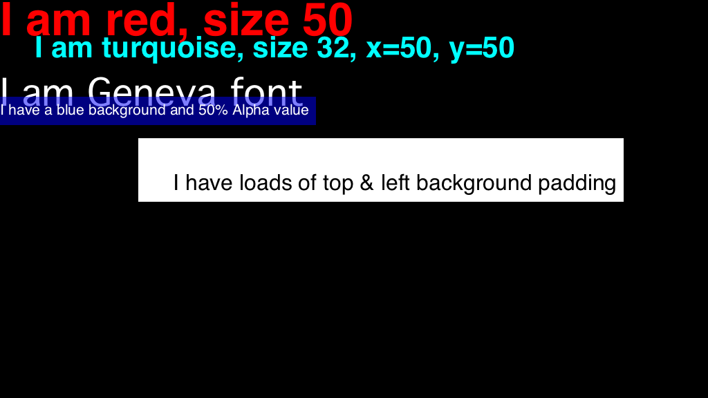

# Examples

This directory contains a number of examples to illustrate the node-snowmix library in use.

## A closer look at some examples

*[image-in-every-corner.js](./image-in-every-corner.js)* creates an image in each corner of the screen, like this:

*[text-lots-of-examples.js](./text-lots-of-examples.js)* creates a variety of text types, like this:

